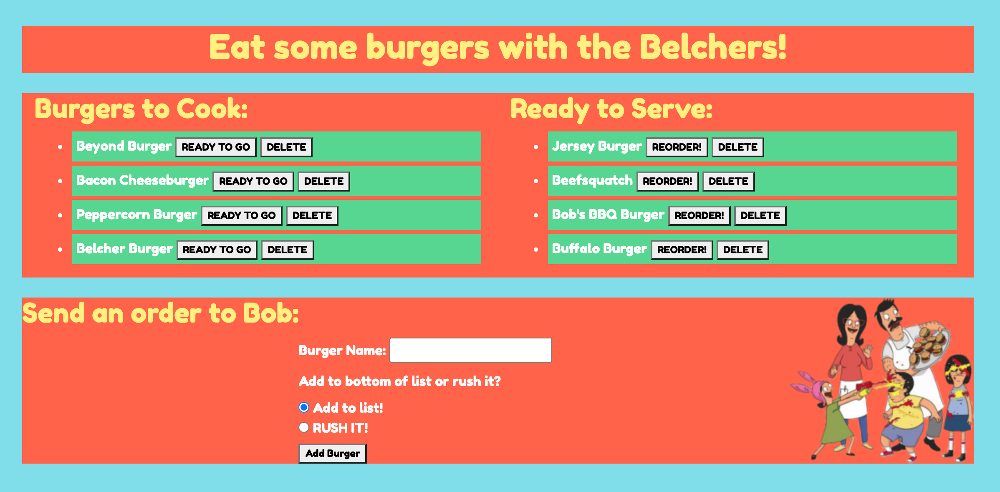

# Belcher Burger Fun

  ## 

  ## TABLE OF CONTENTS
  - [DESCRIPTION](#DESCRIPTION)  
  - [LICENSE](#LICENSE)  
  - [INSTALLATION](#INSTALLATION)   
  - [QUESTIONS](#QUESTIONS)  
  - [CONTRIBUTIONS](#CONTRIBUTIONS)
  - [LINKS](#LINKS)  
  - [SCREENSHOTS](#SCREENSHOTS)  

  ## DESCRIPTION
  For this assignment, we were instructed to create a "Burger" app where a user would submit the burger of their choice to be added to the "burgers to cook list". I also added a "rush" option to send the burger immediately to the ready side. Once the burger is added to the list, the user can chose in what order they send it to the "ready to serve" column. The user can "re-order" the burger and send it back to the "to cook" list, or they can delete the burger.  
  ``````````````````````
Technologies Used:
  - JavaScript
  - CSS 
  - express
  - handlebars
  - MySQL
   ``````````````````````

  ## LICENSE
  Unlicensed
  
  ## INSTALLATION
  - npm i to install all dependencies
  
  ## QUESTIONS  
  My GitHub username is *eplatvoet* & my profile can be found [here](https://github.com/eplatvoet) 
  
  ## CONTRIBUTIONS 
  I can be reached at erin.didomenico520@gmail.com if you have any other questions about this repository.
  
  ## LINKS
  https://github.com/eplatvoet/Burgers  
  https://belcherburgerfun.herokuapp.com/  

  ## SCREENSHOTS
  
  